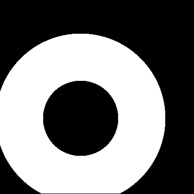

<h1>WobblyStitcher</h1>

<h2>Introduction</h2

A scalable implementation
of <a href="https://christophkirst.github.io/ClearMap2Documentation/html/wobblystitcher.html#wobblystitcher">WobblyStitcher</a>

<h2>Dependencies</h2>
<pre>
$ python3 -m pip install numpy scikit-image
</pre>

<h2>Visualization</h2>

<a href="https://imagej.nih.gov">ImageJ</a>

<h2>Getting started</h2>

Generate four files with fake input
<pre>
$ (cd tool && make)
$ ./tool/gen -n 200 200 200 -o 10 10
$ ls -1 *.raw
200x200x200le.00.00.raw
200x200x200le.00.01.raw
200x200x200le.01.00.raw
200x200x200le.01.01.raw
</pre>

stitch
<pre>
$ python3 main.py
main.py: processes = 4
46% 391x391x200le.raw
</pre>

Open <tt>390x390x200le.raw</tt> in ImageJ.

<h2>Similar programs</h2>

<a href="https://imagej.net/plugins/bigstitcher">BigStitcher</a> 
<a href="https://abria.github.io/TeraStitcher">TeraStitcher</a> 
<a href="https://christophkirst.github.io/ClearMap2Documentation/html/home.html">ClearMap</a>

<h2>References</h2>

1. Kirst, C., Skriabine, S., Vieites-Prado, A., Topilko, T., Bertin,
P., Gerschenfeld, G., ... & Renier, N. (2020). Mapping the fine-scale
organization and plasticity of the brain vasculature. Cell, 180(4),
780-795.
